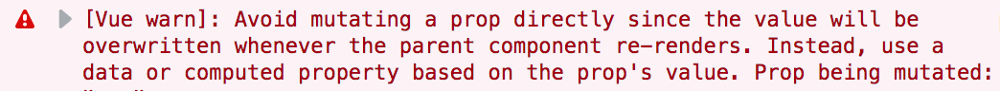

Intro



## How is this caused?


## Mutating props in Vue is an anti-pattern
Here is the error message in full:

> Error message: Avoid mutating a prop directly since the value will be overwritten whenever the parent component re-renders. Instead, use a data or computed property based on the prop's value.

The [docs also explain](https://vuejs.org/v2/guide/migration.html#Prop-Mutation-deprecated) what's going on here.

In Vue, we pass data down the the component tree using props. A parent component will use props to pass data down to it's children components. Those components in turn pass data down another layer, and so on.

Then, to pass data back up the component tree, we use events.

We do this because it ensures that each component is isolated from each other. From this **we can guarantee a few things that help us in thinking about our components**:
- Only the component can change it's own state
- Only the parent of the component can change the props

If we start seeing some weird behaviour, knowing with 100% certainty where these changes are coming from makes it much easier to track down.

Keeping these rules makes our components simpler and easier to reason about.

### Props are overwritten when re-rendering
There is another thing to keep in mind.

When Vue re-renders your component -- which happens every time something changes -- it will overwrite any changes you have made to your props.

This means that even if you try to mutate the prop locally, Vue will keep overwriting those changes.

Not a very good strategy, even if you don't think that this is an anti-pattern.

## Modifying value in the component
Now we get to the main reason why someone might want to mutate a prop.

There are many situations where we need to take the prop that we are passed, and then do something extra with it.

Maybe you need to take a list and sort it, or filter it.

Maybe it's taking some numbers and summing them together, or doing some other calculation with them.

Well, we _still_ don't mutate the prop.

Instead, you can use the always useful computed prop to solve the same problem.

### Simple example
We'll start with a simple example, and then move on to something a little more interesting.

In our `ReversedList` component we will take in a list, reverse it, and render it to the page:
```html
<template>
  <ul>
    <li v-for="item in list" />
  </ul>
</template>
```
```js
export default {
  name: 'ReversedList',
  props: {
    list: {
      type: Array,
      required: true,
    }
  },
  created() {
    // Mutating the prop :(
    this.list = this.list.reverse();
  }
};
```

This is an example of a component that, although functional, isn't written very well.

__In fact, it isn't completely functional either.__

It will only reverse the initial list it is given. If the prop is ever updated with a new list, that won't be reversed 😕.

But, we can use a computed prop to clean this component up!
```html
<template>
  <ul>
    <li v-for="item in reversedList" />
  </ul>
</template>
```
```js
export default {
  name: 'ReversedList',
  props: {
    list: {
      type: Array,
      required: true,
    }
  },
  computed: {
    reversedList() {
      return this.list.reverse();
    }
  }
};
```

We setup the computed prop `reversedList`, and then swap that out in our `li` tag.

The functionality is also fixed now, as `reversedList` will be recomputed every time that `list` is updated.

We're just getting started though. Let's move on to something a little more complicated.

### The (more) complicated example
Okay, so you might have already known to use computed props like we just showed.

But what if you don't always want to use the computed value?

How do we switch between using the prop passed in from the parent, and using the computed prop?

Let's expand our example.

Now we will have a button in our component that will toggle reversing the list. This way we will be switching between using the list as-is from the parent, and using the computed reversed list:
```html
<template>
  <div>
    <!-- Add in a button that toggles our `reversed` flag -->
    <button @click="reversed = !reversed">Toggle</button>
    <ul>
      <li v-for="item in reversedList" />
    </ul>
  </div>
</template>
```
```js
export default {
  name: 'ReversedList',
  props: {
    list: {
      type: Array,
      required: true,
    }
  },
  data() {
    return {
      // Define a reversed data property
      reversed: false,
    };
  },
  computed: {
    reversedList() {
      // Check if we need to reverse the list
      if (this.reversed) {
        return this.list.reverse();
      } else {
        // If not, return the plain list passed in
        return this.list;
      }
    }
  }
};
```

First, we define a variable in our reactive data called `reversed`, which keeps track of whether or not we should be showing the reversed list.

Second, we add in a button. When the button is clicked, we toggle `reversed` between `true` and `false`.

Third, we update our computed property `reversedList` to also rely on our `reversed` flag. Based on this flag we can decide to reverse the list, or just use what was passed in as a prop.

**Here we see a bit more of the power and flexibility of computed props.**

We don't have to tell Vue that we need to update `reversedList` when either `reversed` or `list` change, it just _knows_.

## Getting tripped up by v-model
It's also a little confusing how `v-model` works with props, and [many people run into issues with it](https://stackoverflow.com/questions/42614242/avoid-mutating-a-prop-directly-in-vuejs-2). This error is not uncommon when using it.

Essentially `v-model` takes care of passing down your prop as well as listening to the change event for you. It also takes care of some edge cases, so you don't have to think too much more.

The important thing here, is that `v-model` is mutating the value that you give to it.

This means that **you can't use props with v-model**, or you'll get this error.

Example of what not to do:
```html
<template>
  <input v-model="firstName" />
</template>
```
```js
export default {
  props: {
    firstName: String,
  }
}
```

Instead, you need to handle the input changes yourself, or include the input in the parent component.

You can check out [what the docs have to say](https://vuejs.org/v2/guide/forms.html#Basic-Usage) about `v-model` for more information.
