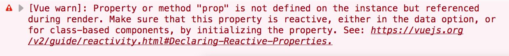
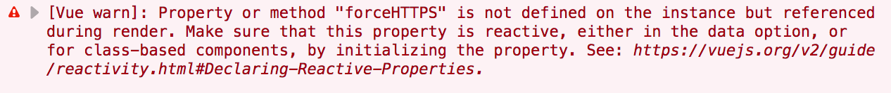

Chances are if you've been developing with Vue for any amount of time, you've gotten this error:



**Most of the time this error is because you misspelled a variable name somewhere.**

But there are other causes as well.

I've gotten this one so many times, because it's a fairly easy mistake to make. Luckily, **fixing it is pretty easy** too, and I'm no longer stumped by it like I was when I first encountered it.

## What does the warning mean?
The full message is this:
>>> [Vue warn]: Property or method "prop" is not defined on the instance but referenced during render. Make sure that this property is reactive, either in the data option, or for class-based components, by initializing the property. See: https://vuejs.org/v2/guide/reactivity.html#Declaring-Reactive-Properties.

This gist of the error is this.

**Vue is trying to render your component, and your component wants to use the property `prop`, but Vue can't find `prop` anywhere.**

You don't need to worry about the reactive properties part of the error for now. As long as you define things in `data` you'll be okay (but it is good to understand how reactivity works).

So, let's take a look at the 2 main problems that can cause this warning!

## 1. You misspelled a variable name
This is the one that always gets me.

I was typing too fast, or wasn't paying enough attention. I misspelled a variable name, and now _Vue is complaining_ because it doesn't know what I'm trying to do.

It's a pretty easy mistake to make:
```html
<template>
  <div>
    {{ messag }}
  </div>
</template>
```
```js
export default {
  data() {
    return {
      message: "Hello, world!"
    };
  }
};
```

Whenever I see this warning I make sure to closely inspect my code and ensure I haven't made any weird typos.

But if there are no typos, the problem lies somewhere else!

## 2. The value is defined on a different component
This is another [common mistake](https://stackoverflow.com/questions/42908525/vue-warn-property-or-method-is-not-defined-on-the-instance-but-referenced-dur) that is easy to make.

Components are scoped, meaning that something defined in one component isn't available in another. You have to use props and events to move things between components.

But just like making a typo, it's pretty easy to forget that a method or property is on one component, **when it's actually on a different one.**

How does this happen?

Well, sometimes you'll want to define multiple components in one file. It might look something like this:
```html
<!-- Template for the Page component -->
<template>
  <ul>
    <link-item url="google.com" text="Google" />
    <link-item url="yahoo.com" text="Yahoo" />
    <link-item url="facebook.com" text="Facebook" />
  </ul>
</template>
```
```js
// Clean up some code by using another component
const LinkItem = {
  props: ['url', 'text'],
  template: `
    <li>
      <a
        :href="url"
        target="_blank"
      >
        {{ text }}
      </a>
    </li>
  `
};

// Define the Page component
export default {
  name: 'Page',
  components: { LinkItem },
};
```

Instead of rewriting the `<li>` tag each time, we just encapsulated it inside of the `LinkItem` component.

But let's say we have a method on our `Page` component that forces us to always use HTTPS instead of HTTP:
```js
methods: {
  forceHTTPS(url) {
    // ...
  }
}
```

What `forceHTTPS` actually does is unimportant here.

But let's use it on our URLs so that we can make sure our app only links to safe website. We'll update `LinkItem` to use this method:
```diff
const LinkItem = {
  props: ['url', 'text'],
  template: `
    <li>
      <a
-       :href="url"
+       :href="forceHTTPS(url)"
        target="_blank"
      >
        {{ text }}
      </a>
    </li>
  `
};
```

We save it, our page refreshes, and...



Whoops.

It turns out that we forgot that `forceHTTPS` isn't defined on the `LinkItem` component, but instead it's defined on the `Page` component!


Because the two components were in the same file, **it was easy for us to get mixed up with what was and wasn't in scope**. This is one reason why it can be a good idea to separate things out into their own files, even if it's only a few lines long.

Let's fix that then:

```diff
const LinkItem = {
  props: ['url', 'text'],
+ methods: {
+   forceHTTPS(url) {
+     // Do some stuff...
+   }
+ },
  template: `
    <li>
      <a
        :href="forceHTTPS(url)"
        target="_blank"
      >
        {{ text }}
      </a>
    </li>
  `
};
```

Now things should be dandy.

As you can see, it's **pretty easy to mess this up** and forget that a value is on a different component. Thankfully Vue has this handy warning!

## Conclusion
If you have this warning all of the time, don't worry about it!

It's really common, and even though I have a lot of experience with Vue, **I still get this one all of the time.**

To recap, the two main causes of this are:
1. You have a typo somewhere when naming a property or method
2. The property or method exists on a different component

If you're still having trouble with this warning, the problem may lie elsewhere. Ping me on [Twitter](https://twitter.com/MichaelThiessen) and I'd love to help you out with it!
