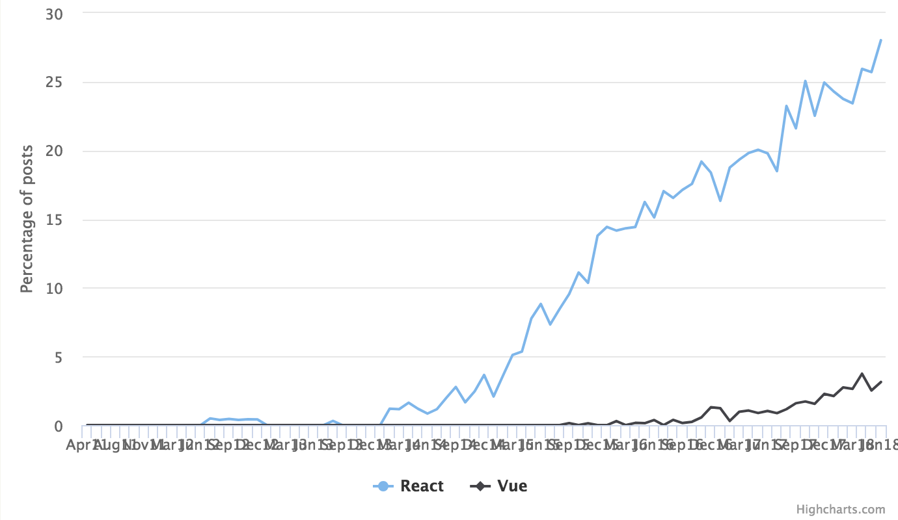
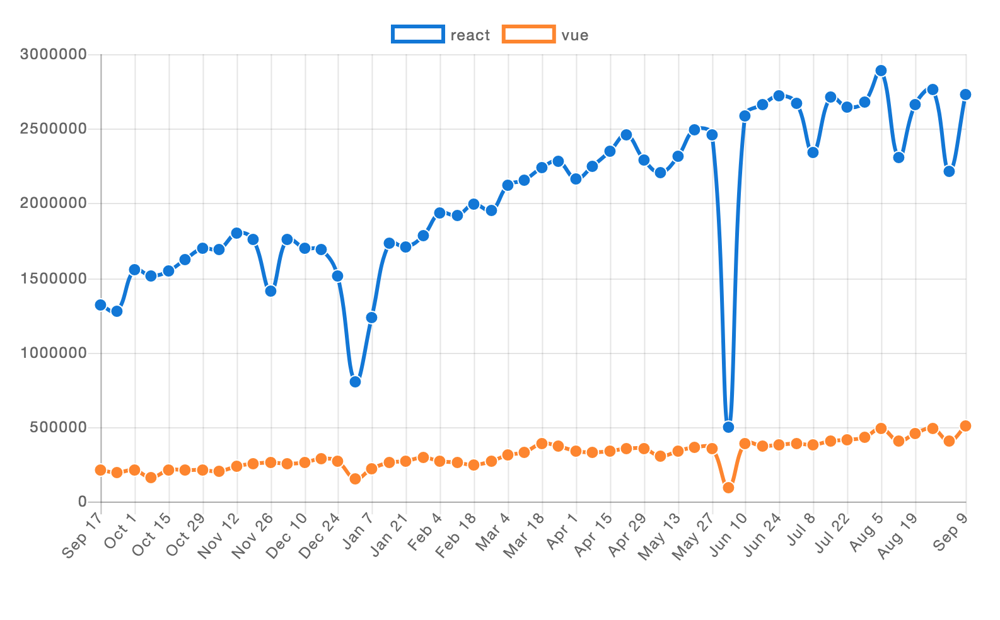
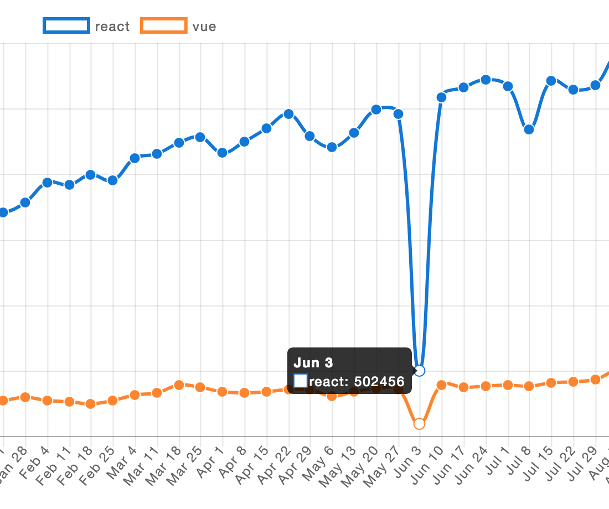
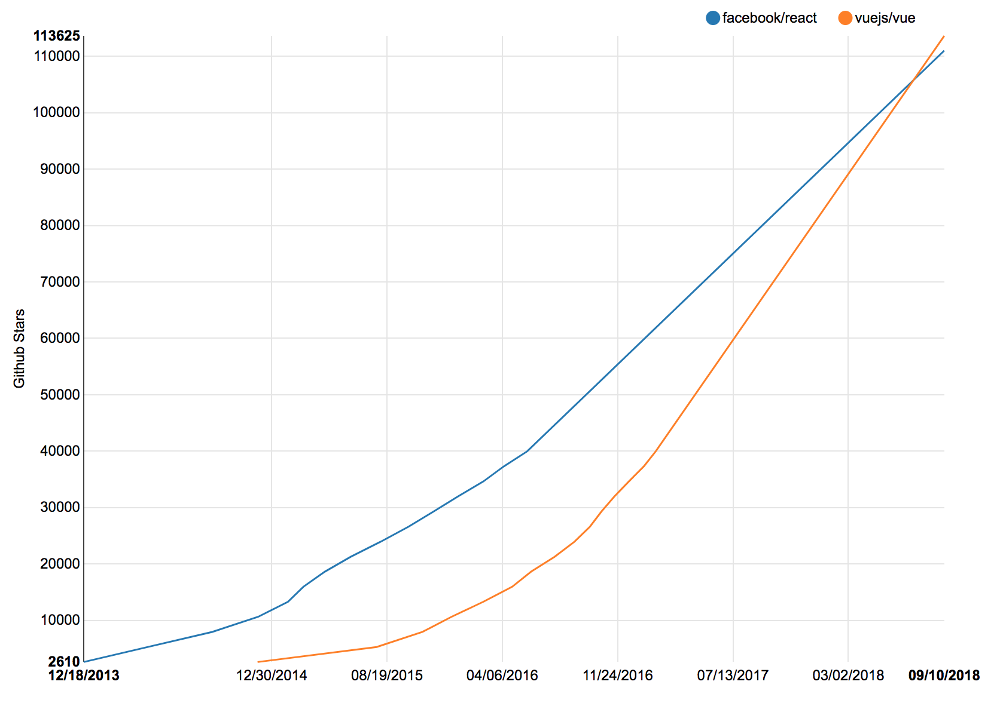
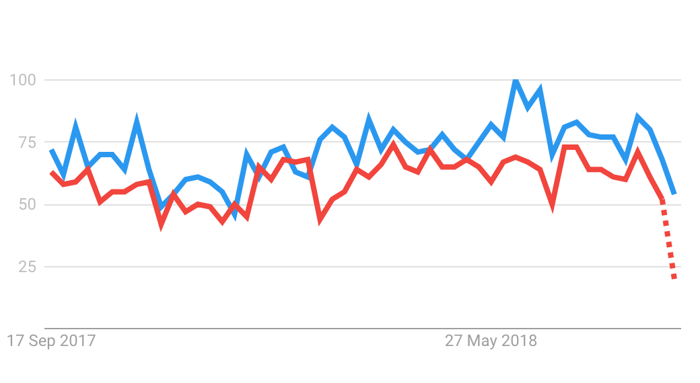
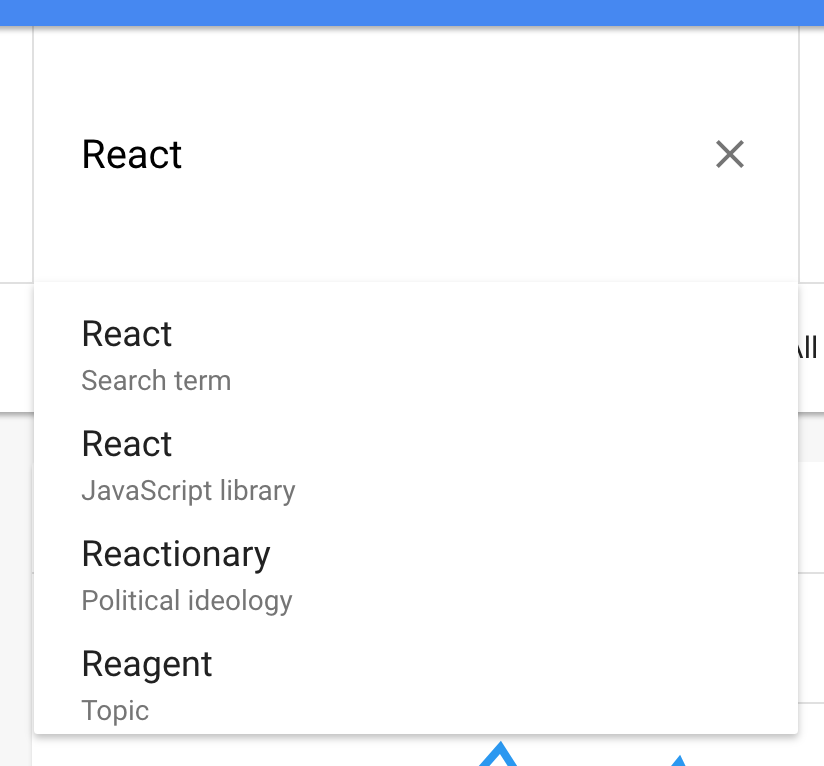
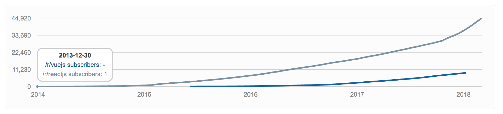

It's the age old -- or maybe year old -- question.

**Which is better, React or Vue?**

A large part of the Javascript community has become obsessed over this. Each person picks their side, and like sports fans we cheer on our team to "victory".


Although it's good to discuss the differences between the frameworks, to compare the finer details of which is more performant, easier to pick up, or more productive (whatever that means), many of these comparisons are nothing more than speculation based on a few weeks of experience.

**We need cold, hard, data.**

We need to look at the numbers to see not what people think, but what people are doing.

## The Data
I've looked at several different metrics here, but **take these numbers with a grain of salt**.

Each of these metrics has their flaws, some of them providing more of a signal than others. The hope is that in aggregate, these metrics will provide at least *some* insight, and that we may better **understand how React and Vue are growing in relation to one another**, and what exactly that might mean.

The metrics we'll be looking at are:
- Hacker News popularity
- NPM downloads
- Github stars
- Google Trends
- Reddit subscribers

## Hacker news trends
Hacker News may not be a representative sample of the broader software development community, but for our purposes it's a fairly good proxy.

It's very popular, and the articles posted there are fairly diverse in subject matter. It seems plausible that the popularity of any technology on HN would at least be indicative of it's true popularity.



Using [a chart from HN Trends](https://www.hntrends.com/2018/aug-summer-hiring-heats-up-react-fire.html?compare=React&compare=Vue) we can see that both React and Vue have been growing a lot in popularity over the last few years.

About the data:
- Starts in 2011, well before either framework was created
- Y axis shows the percentage of all articles that are on that topic

At first glance it appears that React is a rocket, with Vue steadily plodding along. However, although React is much more popular in absolute terms, Vue is the real rocket ship here.

### The Numbers
We'll compare an average of the months June, July, and August of 2017 with those same months in 2018 to get our growth rates. I'm taking this moving average to try and reduce some of the volatility in the numbers.

First, React:
```
React

June, July, August of 2017
(19.79 + 18.49 + 23.23) / 3 = 20.5%

2018
(28.02 + 27.74 + 26.94) / 3 = 27.57%
```

In 2017 **20.5%** of HN articles were about React, and in 2018 **27.57%** were. This gives us a growth rate of:
```
(27.57 - 20.5) / 20.5 = 0.345 = 34.5%
```

Or, **34.5% growth year over year**.

Now we'll look at Vue:
```
Vue

2017
(1.03 + 0.87 + 1.16) / 3 = 1.02%

2018
(3.14 + 3.23 + 3.71) / 3 = 3.36%
```

This gives us **1.02%** of articles in 2017 that were focused on Vue, and then up to **3.36%** in our 2018 sample. This gives us a growth rate of:
```
(3.36 - 1.02) / 1.02 = 2.294 = 229.4%
```

We get a **229% growth year over year for Vue**.

### Comparison
The numbers speak for themselves. In terms of HN posts, **Vue is growing at 229% versus React's 34.5%**.

This means that **Vue is growing 6.6 times faster than React** is -- at least on Hacker News.

But we have several other metrics to compare.

How does Vue stack up against React on something like package downloads?

## NPM downloads


The [number of downloads](https://www.npmtrends.com/react-vs-vue) that each framework is getting is probably the most reliable indicator of usage.

The other indicators could simple express people's growing interest. But if you're downloading the package, you're likely using it as well.

Tracking downloads from NPM isn't perfect though.

You'll typically download a framework once, and it will be cached locally. Lots of companies will run their own NPM server and cache it there. And many times assets will be bundled up and stored in a Docker container (yet another type of caching).

However, it's pretty fair to assume that caching affects React and Vue equally, so comparing their downloads should be okay.

### The Numbers
We'll do a similar moving average to reduce volatility, but this time over a period of 3 weeks.

For 2017 we average downloads for the weeks of August 27, September 3, and September 10. For 2018 we use the weeks of August 26, September 2, and September 9.

React has a very impressive number of downloads per week:
```
React

2017 (Aug 27, Sept 3, Sept 10):
(1,157,501 + 1,156,048 + 1,206,494) / 3 = 1,173,348

2018 (Aug 26, Sept 2, Sept 9):
(2,762,018 + 2,217,924 + 2,730,522) / 3 = 2,570,155
```

From 1.2 million downloads per week to 2.6 million, that's a pretty significant growth rate:
```
(2,570,155 - 1,173,348) / 1,173,348 = 1.19
```

React's downloads have grown **119%** in the last year!

But let's take a look at what Vue has done in that same time frame:
```
Vue

2017:
(163,034 + 155,984 + 164,172) / 3 = 161,063

2018:
(490,816 + 403,662 + 503,945) / 3 = 466,141
```

Where React has grown 119% in downloads per week, **Vue has grown 189%!**

This means that Vue has grown **59% faster** than React in terms of downloads.

But wait a second.

Vue's growth in Hacker News posts versus React was 564%, but here it is only 59%. That's almost a 10x difference!

I wonder which is closest in terms of the true trend?

### The mysterious June 3rd


Also, did anyone else notice this huge dip on June 3rd?

I have zero ideas what happened here, and researching it turned nothing up. Perhaps NPM was down briefly?

If anyone knows what caused this, I'd love to know!


## Github Stars


If you've been following Vue or React for any amount of time, I'm sure you've seen this one.

Earlier this summer Vue surpassed React in number of [stars on Github](http://www.timqian.com/star-history/#facebook/react&vuejs/vue), and [Dan Abramov captured](https://twitter.com/dan_abramov/status/1007439168400654336) this "historic" moment on Twitter.


But we all know that Github stars don't really matter -- right?

Well, they do matter.

You see, there are some lazy developers out there who don't want to take the time to properly evaluate 3rd party libraries when choosing one. Instead they look for social proof in the form of Github stars, and simply choose the library that has the most.

If we're honest with ourselves, we know that we often take this approach. Sometimes when we know we shouldn't.

To be fair, humans use social proof all of the time because otherwise we would never be able to make all of the decisions we need to. In many cases simply choosing the most popular is a valid strategy.

Because of this, having a lot of Github stars provides a very strong signal that the library is considered by the community to be valuable and useful. This is the entire reason Github has this feature in place.

For those interested, there is some [interesting discussion](https://opensource.stackexchange.com/questions/5110/github-stars-is-a-very-useful-metric-but-for-what) on Stack Overflow about how useful this metric is for research.

<h3 class="new-page">The Numbers</h3>

I got my trend data [here](http://www.timqian.com/star-history/#facebook/react&vuejs/vue), but the tooltips were really finnicky so I couldn't get data on the exact dates I wanted 🤷‍♂️.

For the last metrics I was tracking year over year growth, but I could only grab data 2 years apart. So here I will calculate growth over the last 2 years, and from that get the average year over year growth. It will be slightly less than the actual growth over the last year, but it should still be fine for comparing relative growth between Vue and React.

Again, we start with data for React:
```
React

September 29, 2016: 39,960
September 10, 2018: 111,004
```

Calculating growth over the last 2 years of:
```
(111,004 - 39,960) / 39,960 = 1.78
```

React's Github stars have grown **178** over the last two years, which gives us roughly **89% growth over the last year**.

As you can tell from the graph, Vue is growing pretty quick too:
```
Vue

September 29, 2016: 26,610
September 10, 2018: 113,625
```

To get our growth rate:
```
(113,625 - 26,610) / 26,610 = 3.27
```

So we get a growth rate of 327% or **163.5% per year**.

Vue is gaining Github stars **92.4% faster than React**!

Yet another solid win for Vue.

But how long can this streak continue?

<h2 class="new-page">Google trends</h2>



Not very long, it turns out.

The number of searches people do on Google every day is staggering, and provides us with a lot of really good data into what people are interested in.

[Google Trends](https://trends.google.com/trends/explore?geo=US&q=reactjs,vuejs) unfortunately gives us nothing very interesting at all. This graph is completely sideways and doesn't really tell us anything.

The terms I used for this were `reactjs` and `vuejs`, which don't exactly capture all of the search terms that are related to either of these frameworks.

However, Google does understand that React is a Javascript framework, which would make this data a lot better.



But it doesn't understand Vue as a Javascript framework, so it wouldn't be a valid comparison.


Perhaps once Vue becomes more popular Google will have enough data to recognize it as a Javascript framework, and we'll be able to make this comparison a lot better.

<h2 class="new-page">Reddit subscribers</h2>



The last metric -- however loose you define that word -- is growth in Reddit subscribers.

Each subreddit is it's own community, so I'm not sure how much value knowing the number of subscribers gets us. What's really important here is what goes on in each subreddit.

A healthy community will have more discussion, with less spammy links being posted. People will share ideas and great articles, and it will be a great place to go to learn new things.

Taking a cursory look at [/r/vuejs](https://www.reddit.com/r/vuejs) and [/r/reactjs/](https://www.reddit.com/r/reactjs/), it seems like the React community on Reddit is much healthier.

But what do the numbers say?

<h3 class="new-page">The Numbers</h3>

We'll use [reddit metrics](http://redditmetrics.com/r/vuejs#compare=reactjs) to get our data. For some reason it doesn't provide data for Vue beyond January 2018, so we'll have to compare year over year growth between January 2017 and January 2018.

As always, React will go first:
```
React

2017: 18,203
2018: 36,779

Growth: (36,779 - 18,203) / 18,203 = 1.02
```

The growth of /r/reactjs has been **102%** through 2017.

Now looking at Vue:
```
Vue

2017: 2,489
2018: 8,845

Growth: (8,845 - 2,489) / 2,489 = 2.55
```

We get a growth rate of **255%** for /r/vuejs.

From this we can see that /r/vuejs is gaining reddit subscribers 150% faster than /r/reactjs.

Now, what do all of these numbers mean?

## Why such growth and other interesting things

Most of these metrics, when taken in isolation, don't seem to be that great. But in aggregate they form a much sturdier foundation.

It's pretty clear from all of this that Vue is growing at a much faster pace than React is. Whether it's closer to 50% or 500% is harder to tell. That said, I'd be extremely surprised if it was growing more than 2x as fast, so **I would wager somewhere between 10% - 100%** if I had to make a very wild but somewhat educated guess.

I could speculate about why this is:
* Vue is less popular so fast growth is easier
* React is getting closer to saturating the frontend framework market
* China favours Vue over React, and are starting to build more web apps
* Vue is objectively 5x better than React don't @ me

**But does it really matter?**

## It's not a contest

As a community we need to stop caring about which framework "wins". It's a childish game and no one is better off for it (but everyone wins in a dog surfing contest).


Competing ideas are great, because it accelerates innovation and brings us better tools to do our jobs.

But at the end of the day, you need to choose the tool that does the job the best.

If React is better for your team or your product, use React. If Vue is the better choice, use Vue. They're so similar that in the end it doesn't matter so much which one you end up using.

Pick one, and learn it well. Then stop arguing about which is better on Twitter and spend more time learning it even better.

Then you can do your actual job better, and you can make better things, and more of them. This is what truly matters here.

The main takeaway for me is that *both* React and Vue are growing extremely fast, and that could mean many things for us as web developers:
* We're probably on the right track with this idea of components and stuff
* Web apps are in high demand and people are finding more and more use for them
* Developers (you and me), as the people who build these apps, are also increasingly in demand
* Technological adoption can happen at a staggering rate!

So please, stop bickering and write some code.
