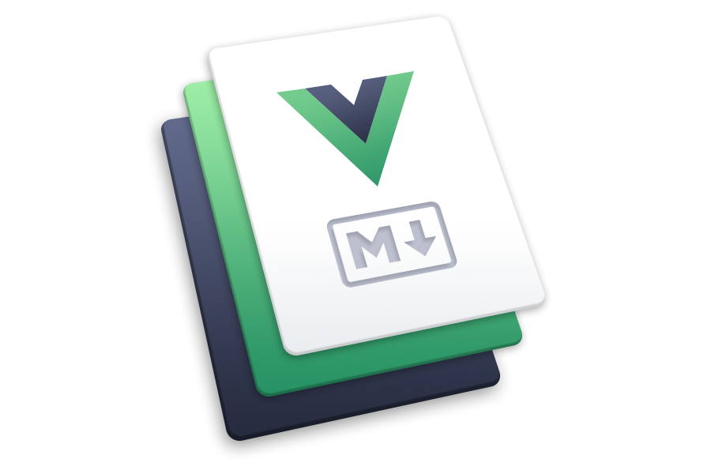

Keywords:

- vue blog template
- vue blog example
- vue blog tutorial
- vuejs blog tutorial
- vuejs blog template
- vue cms
- vue.js blog template

lots of pictures!!!!

## I really need to rebuild this blog

When I started this blog the most important thing to me was to write, and write consistently.

For us developers it's really easy to procrastinate by playing around with the technology, redesigning the website, adding new features, or refactoring old code. All of this may _seem_ productive, but it's just an elaborate -- and very fun -- way to avoid the scary task of writing words and hitting "publish".

So I intentionally put off the design of the site, spending just enough time on it to get a working MVP.

And let's be honest here, it's pretty mediocre.

But the site is gaining lots of momentum.

At the time of writing this site is doing more than 13,000 pageviews per month. I feel this blog is now at a point where I should shift my priorities and design an actual site and build out more of the features I want.

## What's wrong with the blog?

While I could do a redesign and add any missing features with my current setup, I really want to swap out my tech stack entirely. There are 2 main reasons for this.

The first is that **this is a blog about Vue, yet it's built in React**.

I initially chose Gatsby because I knew I could get up and running quickly. But it's _kind of awkward_ to be spending all of this time talking about how to write Vue apps when the site itself isn't in Vue. I have to practice what I preach, right?

The second reason is more educational.

By switching to using Vue, I'll also get a chance to **play around with more things in the Vue ecosystem**. It's more fun, but it will also turn into more blog posts. So we're hitting two birds with one stone.

## My current setup

Most modern blogging tech stacks can broken up into 3 different parts:

1. Blogging framework
2. Content Management System
3. Hosting

The biggest one is the blogging framework, so that's what I'll be spending most of my time on.

### Blogging Framework

As mentioned earlier, I'm currently using [Gatsby](https://www.gatsbyjs.org/) as my blogging platform. It's built in React, and is blazing fast and very easy to configure. I have zero complaints with it, and if I wasn't writing exclusively about Vue I would probably just stick with it.

It's a _static PWA generator_, which means it spits out a website that is a collection of static HTML pages. However, once you load a page, the Javascript takes over and it bootstraps itself into a single page app.

This means that you get all the speed and SEO benefits of having your site pre-rendered, yet once the first page loads every next page is instantaneous.

**You only ever need to hit the server once per session**.

I absolutely _love_ this setup, and the 4 alternatives I'll be looking into all do this -- except they use Vue 😉.

### Content Management System

The main purpose of a blog is to deliver static content, and hopefully lots of it. This means you need a good way of writing, editing, publishing, and managing your content.

Right now I don't have a CMS.

I write all of my posts in Markdown, which I have absolutely loved. At first I tried using Google Docs, but that was a disaster.

But Markdown is amazing, and here's why.

It's familiar to me since I use it every day at my job. It allows me to focus on what I'm writing, and stops me from getting distracted by formatting.

And since I'm writing technical posts, I need to write lots of code examples. Using Markdown is a natural choice for this, since it gives me syntax highlighting for free since I use my code editor to write it.

I don't think I need anything much fancier than this. Although it would be nice to be able to drop Vue components straight into my Markdown...

### Hosting

This one is super boring.

For hosting I just use a [basic hosting](https://asmallorange.com/) service that I've had for years. It worked to get my site up and running quickly, but there's a lot of room for improvement here.

I've seen other hosting solutions that are much cheaper, integrate with Github, and have other more advanced features that look really interesting.

But we'll get to that in a moment.

First, I need to lay out exactly what I'm looking for.

## My blog wish list

There are many things that I could look for in a blog, but there a few main ones. All of the alternatives I'm looking at do these things, so it's mostly a matter of figuring out which one does them the best.

## Really easy to make changes

This is one of the reasons why I think Wordpress has gained so much adoption.

You write your posts, you set their publish date, and then you're done. You don't have to deal with complex build systems, or deal with manually uploading or changing files.

Another thing I really like is that you can publish multiple posts at once, but have them set to be released on a schedule. This lets you batch your work, making things more efficient.

I also need to be able to preview drafts easily, as well as any changes I'm making to the site.

## Add Vue components into Markdown

Currently I'm using Markdown to write all of my posts, and I don't want to change that.

However, I do want to the ability to drop Vue components straight into my Markdown posts and have them render. This will make my examples better, since I can have them running right inside of my post.

It also gives me a lot more flexibility in being able to add different kinds of functionality within my posts. For example, I could add an email subscription call-to-action component to each post.

## Static site -> PWA

As mentioned before, one of the things I really love about Gatsby is that it's a statically generated site that will bootstrap itself into a PWA once you load the page.

There's often a debate between server side and client side rendering, but here you get the benefits of both worlds!

## Picking my tech stack

Now that I've figured out my requirements, I need to decide what my tech stack will look like.

I don't want to just randomly choose and commit 100%, so I'll be testing each of these out and see how they stack up against each other. And yes, you can expect some posts in the future exploring each of these in turn.

If you want to follow along with this process, sign up to my newsletter and I'll send an email whenever a new post comes out!

_You can subscribe at the bottom of the post._

## The Contenders

Here are the contenders, ranked based on my initial impressions (which are _very_ rough). I am sure that this will change as I investigate them more thoroughly.

### 1. Vuepress

This is officially supported by the Vue core team, and is built specifically with documentation in mind. Now, documentation isn't that different from blogging, so they've recently added more first-class support for blogging to the platform.

What this means is that Vuepress already has lots of the abstractions and features built into it that I would need for my blog.

We get a statically generated site that bootstraps itself into a PWA, and an easy-to-use content system that uses Markdown (and you can [put Vue components straight in!](https://vuepress.vuejs.org/guide/using-vue.html)). There is also a plugin-based architecture for extending the functionality of the site more easily.

Not to mention lots of other great features like [permalinks](https://vuepress.vuejs.org/guide/permalinks.html) and [Markdown slots](https://vuepress.vuejs.org/guide/markdown-slot.html) for more composability.

My only concern is that version `1.x.x` is still in the alpha stage. So it might be just a _little_ too early for me.

### 2. Gridsome

This one is brand new, having only been out for a few months (though it's been in development for over a year), and it looks really good. Essentially, it's Gatsby but for Vue -- even their marketing website is similar!

Honestly, this is a very close second right now. It looks like it has all of the features I want, and looks like an amazing project.

My concerns are that right now there are only 2 developers actively working on it, and it's so new. It may be a little unfair to judge it that way, but I don't have much to go on yet.

Once I start to dig into these frameworks then I'll be able to judge them on their merit alone, and my hope is that Gridsome turns out to be incredible.

### 3. Nuxt

Nuxt JS is another really great option. I've been wanting to play around with this one for quite some time now.

It's an application framework that allows you to build static generated websites, single page apps, as well as universal applications (client side + server side together).

My understanding is that it is geared more towards large, complex, applications, so it might be overly complex for a simple blog. However, if you're building the next Slack or Facebook and need some serious power, it's probably the best choice.

Where I work we're starting the slow process of breaking up our monolithic Rails app into microservices. I've had my eye on Nuxt for this for awhile now, so experimenting with it here will also help me to get a sense of whether or not it will be a good fit for that.

### 4. Vue CLI

It wasn't obvious to me at first that this was an option, since I was thinking only of frameworks. But a few of you on Twitter (we'll get to that in a moment) suggested this as a possibility.

**Vue CLI 3 is fantastic for setting up a new Vue project**. Even if you aren't using the slick UI.

I've used it in several small demo apps so far, and it's incredibly easy to use and makes the development experience amazing.

One of the best parts is the plugin architecture. This means adding -- or removing -- functionality is extremely easy. We can add PWA functionality through a plugin, as well as other things that we would want for a blog.

I put this one at the bottom of these 4 precisely for this reason.

It doesn't have anything baked into it, and most of the blogging and technical features I want I would need to add or develop myself. Nuxt, Vuepress, and Gridsome all have a leg up in this way because they give me a head start.

## Getting feedback from the community

I have my own preconceived notions of what these frameworks will be like, but I wanted to get some real feedback from the community.

So I created a poll on Twitter which got a great response, 1148 votes!

As you can see, Nuxt is the clear winner, followed by Vuepress and then Gridsome in 3rd. I'm not sure if this is just a sampling of their popularity in the Vue community, or a **true reflection of their merits as blogging platforms**.

I receieved a lot of feedback about these frameworks -- this is just a sampling:

The "Other" category included Vue CLI 3, as well as a lot of frameworks that didn't use Vue at all, or were framework-agnostic. I learned about a lot of frameworks I didn't even know existed!

## How will I decide which to use?
Okay, so where are we at now?

I've decided I need to rewrite and redesign my blogging platform, and established my wish list of features. We've gone through 4 different alternatives that all look very promising -- Vuepress, Gridsome, Nuxt, and Vue CLI.

Lots of you even contributed to my knowledge of this area, which I am very grateful for!

But **how do I decide which framework to use**?

I'll have to test each one out, and then compare their merits and drawbacks. It's the only fair way. Besides, I want to experiment with each of them and know what they're about.

All of these experiments will be published here as I do them. If you subscribe to my newsletter you'll be the first to know when they're published!

